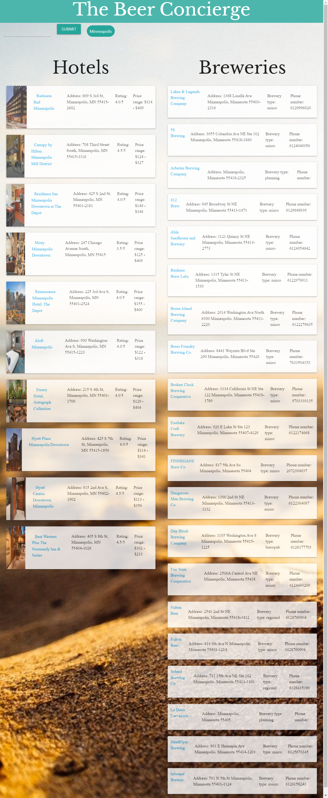

# The Beer Concierge #
## Our Story ##
* Enables the user to quickly find Hotels and Breweries in any specific city in the world
* Helped us understand the importance of clear and concise communication
* Pushing someone forward when one or more teammates may be stuck in the mud
* Keeping eachother on task and utilizing everyones time more effectively
* How to navigate Git Branches and merges more effectively
* Everyone has their own idea on how a problem may be solved, coming to a team agreement on which approach fits best
## Features ##
* Search any city world wide to find Hotels/Breweries in that corresponding city
* Search history displays the last 5 searched cities
* Search history is clickable and will display corresponding information
* Each hotel/Brewery will have a clickable link that will navigate the user in a seperate tab to the corresponding webpage
* The search input text field will clear upon "Focus" 
## Installation ##
1. Open up git bash terminal
2. Change directory to desired location (%User Profile%/SourceRepo)
3. Clone the repository (git clone git@github.com:bvargas17/The-Beer-Concierge.git)
## Usage ##
1. Open index.html in browser.
2. Should see a page like this.

## Credits ##
* https://rapidapi.com/marketplace
* https://www.openbrewerydb.org/
* https://www.google.com/docs/about/
* https://www.w3schools.com/
* https://validator.w3.org/
* https://materializecss.com/
* https://github.com/ChristianGoldman
* https://github.com/bvargas17
* https://github.com/kaidong-chr
* https://github.com/liambambery23
* https://github.com/vina19
* https://github.com/hlamkins
## Link to deployed application ##
* https://bvargas17.github.io/The-Beer-Concierge/
## License ##
    MIT License
    Copyright (c) [2020] [Christian Goldman]
    Permission is hereby granted, free of charge, to any person obtaining a copy
    of this software and associated documentation files (the "Software"), to deal
    in the Software without restriction, including without limitation the rights
    to use, copy, modify, merge, publish, distribute, sublicense, and/or sell
    copies of the Software, and to permit persons to whom the Software is
    furnished to do so, subject to the following conditions:
    The above copyright notice and this permission notice shall be included in all
    copies or substantial portions of the Software.
    THE SOFTWARE IS PROVIDED "AS IS", WITHOUT WARRANTY OF ANY KIND, EXPRESS OR
    IMPLIED, INCLUDING BUT NOT LIMITED TO THE WARRANTIES OF MERCHANTABILITY,
    FITNESS FOR A PARTICULAR PURPOSE AND NONINFRINGEMENT. IN NO EVENT SHALL THE
    AUTHORS OR COPYRIGHT HOLDERS BE LIABLE FOR ANY CLAIM, DAMAGES OR OTHER
    LIABILITY, WHETHER IN AN ACTION OF CONTRACT, TORT OR OTHERWISE, ARISING FROM,
    OUT OF OR IN CONNECTION WITH THE SOFTWARE OR THE USE OR OTHER DEALINGS IN THE
    SOFTWARE.
